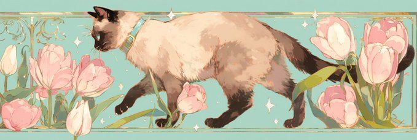
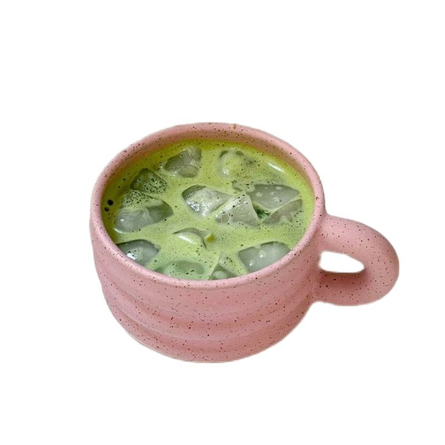

  
  <h1>🍵 Welcome to Nana's Corner! 🍵</h1>

  <b>🔗 Connect with me</b>
   
   

  <!-- Tombol 1: Web Portfolio (Menggantikan About Me) -->
  
  
  <!-- Tombol 2: Instagram (Menggantikan Telegram) -->
  
  
  <!-- Tombol 3: WhatsApp -->
  

  <!-- Tombol 4: LinkedIn -->

<!-- Tombol 5: Gmail -->

<h2>👩‍💻 About Me</h2>

<table>
  <tr>
    <!-- KOLOM KIRI: Teks Deskripsi -->
    <td width="65%" valign="top">
      
Hello There! I'm <b>Nabila</b>, a Software Engineering graduate. I enjoy building clean, creative, and responsive user interfaces for web applications.

      
Currently focusing on refining my skills in front-end technologies and creating eye-catching web designs! 🍵✨

      <ul>
        <li>🌱 <b>Learning:</b> Advanced Front-End, UI/UX Concepts, and JS Logic</li>
        <li>💬 <b>Ask me about:</b> HTML, CSS, Bootstrap, and JavaScript</li>
        <li>⚡ <b>Fun Fact:</b> I love exploring aesthetic pastel color palettes! 🌸</li>
      </ul>
    </td>
    <!-- KOLOM KANAN: Tempat Foto .png Kamu -->
    <td width="35%" align="center" valign="middle">
      
    </td>
  </tr>
</table>

---

  <h3>💻 Technologies 💻</h3>
  
  <!-- HTML5 -->
  
  <!-- CSS3 -->
  
  <!-- JavaScript -->
  
  <!-- Bootstrap -->
  
  <!-- GitHub -->
  

---

  <h3>🍵 My Statistics 🍵</h3>
  <!-- Kotak Statistik Utama -->
  

  <!-- Kotak Bahasa yang Paling Sering Digunakan -->
  

  <!-- Kotak Streak Kontribusi -->
  

---

  <h3>📈 My Contribution Graph 📈</h3>
  <!-- Grafik Kontribusi Tema Terang/Pastel -->
  

